Visualization and EDA
================
Linh Tran
10/5/2020

``` r
library(tidyverse)
```

    ## ── Attaching packages ───────────────────────────────────────────────────────────────────────────────────────────────────────── tidyverse 1.3.0 ──

    ## ✓ ggplot2 3.3.2     ✓ purrr   0.3.4
    ## ✓ tibble  3.0.3     ✓ dplyr   1.0.2
    ## ✓ tidyr   1.1.2     ✓ stringr 1.4.0
    ## ✓ readr   1.3.1     ✓ forcats 0.5.0

    ## ── Conflicts ──────────────────────────────────────────────────────────────────────────────────────────────────────────── tidyverse_conflicts() ──
    ## x dplyr::filter() masks stats::filter()
    ## x dplyr::lag()    masks stats::lag()

``` r
library(ggridges)
```

``` r
#Creating a df using meteo_pull_monitors in the `rnoaa` package

weather_df = 
  rnoaa::meteo_pull_monitors(
    c("USW00094728", "USC00519397", "USS0023B17S"),
    var = c("PRCP", "TMIN", "TMAX"), 
    date_min = "2017-01-01",
    date_max = "2017-12-31") %>%
  mutate(
    name = recode(
      id, 
      USW00094728 = "CentralPark_NY", 
      USC00519397 = "Waikiki_HA",
      USS0023B17S = "Waterhole_WA"),
    tmin = tmin / 10,
    tmax = tmax / 10) %>%
  select(name, id, everything())
```

    ## Registered S3 method overwritten by 'hoardr':
    ##   method           from
    ##   print.cache_info httr

    ## using cached file: /Users/linhmaitran/Library/Caches/R/noaa_ghcnd/USW00094728.dly

    ## date created (size, mb): 2020-10-05 10:25:47 (7.522)

    ## file min/max dates: 1869-01-01 / 2020-10-31

    ## using cached file: /Users/linhmaitran/Library/Caches/R/noaa_ghcnd/USC00519397.dly

    ## date created (size, mb): 2020-10-05 10:25:55 (1.699)

    ## file min/max dates: 1965-01-01 / 2020-03-31

    ## using cached file: /Users/linhmaitran/Library/Caches/R/noaa_ghcnd/USS0023B17S.dly

    ## date created (size, mb): 2020-10-05 10:25:59 (0.88)

    ## file min/max dates: 1999-09-01 / 2020-10-31

``` r
weather_df
```

    ## # A tibble: 1,095 x 6
    ##    name           id          date        prcp  tmax  tmin
    ##    <chr>          <chr>       <date>     <dbl> <dbl> <dbl>
    ##  1 CentralPark_NY USW00094728 2017-01-01     0   8.9   4.4
    ##  2 CentralPark_NY USW00094728 2017-01-02    53   5     2.8
    ##  3 CentralPark_NY USW00094728 2017-01-03   147   6.1   3.9
    ##  4 CentralPark_NY USW00094728 2017-01-04     0  11.1   1.1
    ##  5 CentralPark_NY USW00094728 2017-01-05     0   1.1  -2.7
    ##  6 CentralPark_NY USW00094728 2017-01-06    13   0.6  -3.8
    ##  7 CentralPark_NY USW00094728 2017-01-07    81  -3.2  -6.6
    ##  8 CentralPark_NY USW00094728 2017-01-08     0  -3.8  -8.8
    ##  9 CentralPark_NY USW00094728 2017-01-09     0  -4.9  -9.9
    ## 10 CentralPark_NY USW00094728 2017-01-10     0   7.8  -6  
    ## # … with 1,085 more rows

# Visualization with `ggplot2` - Part I

## Basic scatterplot

To create a basic scatterplot, need to map variables to the X and Y
coordinate aesthetics, add geoms to define

``` r
ggplot(weather_df, aes(x = tmin, y = tmax)) + geom_point()
```

<!-- -->

``` r
#New approach, same plot:

weather_df %>% 
  ggplot(aes(x = tmin, y = tmax)) +
  geom_point()
```

<!-- -->

``` r
#save the output to an object and modify/print later:

plot_weather = 
  weather_df %>% 
  ggplot(aes(x = tmin, y = tmax)) 

plot_weather + geom_point()
```

<!-- --> The
basic scatterplot gave some useful information - the variables are
related roughly as we’d expect, and there aren’t any obvious outliers to
investigate before moving on.

## Advanced scatterplot - additional aesthetic mappings

`name` can be incorporated using the `color` aesthetic

``` r
ggplot(weather_df, aes(x = tmin, y = tmax, color = name)) +
  geom_point() +
  geom_smooth(se = FALSE)
```

    ## `geom_smooth()` using method = 'loess' and formula 'y ~ x'

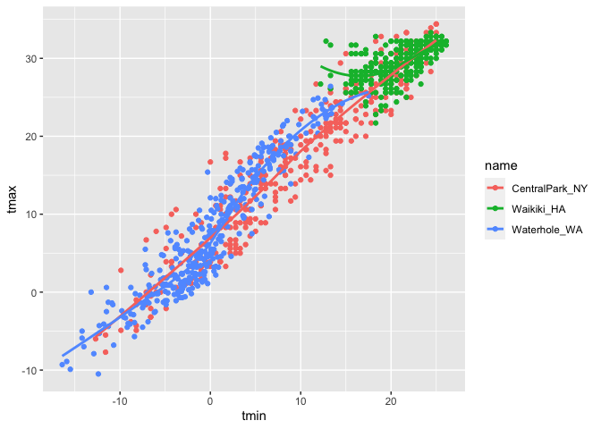<!-- -->

``` r
#`name` can be incorporated using the `color` aesthetic

ggplot(weather_df, aes(x = tmin, y = tmax)) +
  geom_point(aes(color = name))
```

<!-- -->

``` r
#add a smooth curve and make the data points more transparent.
ggplot(weather_df, aes(x = tmin, y = tmax)) +
  geom_point(aes(color = name), alpha = 0.5) +
  geom_smooth(se = FALSE)
```

    ## `geom_smooth()` using method = 'gam' and formula 'y ~ s(x, bs = "cs")'

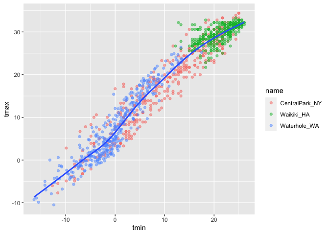<!-- --> The
curve gives a sense of the relationship between variables, and the
transparency shows where data are overlapping. However, the smooth curve
is for all the data but the colors are only for the scatterplot. That is
because X and Y mappings apply to the whole graphic, but color is
currently geom-specific. I am having a hard time seeing everything on
one plot, so I’m going to add facet based on name as well.

``` r
#add facet based on name

ggplot(weather_df, aes(x = tmin, y = tmax)) +
  geom_point(aes(color = name), alpha = 0.5) +
  geom_smooth(se = FALSE) +
  facet_grid(. ~ name)
```

    ## `geom_smooth()` using method = 'loess' and formula 'y ~ x'

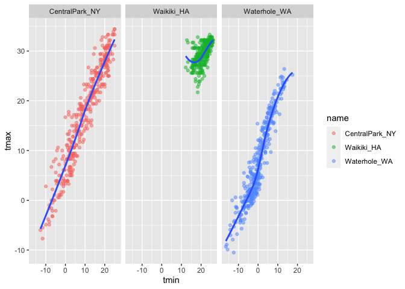<!-- -->

``` r
ggplot(weather_df, aes(x = tmin, y = tmax, color = name)) +
  geom_point(alpha = .2, size = 0.6) +      #alpha =.5 equals to 50% transparency
  geom_smooth(se = FALSE) +
  facet_grid(. ~ name)
```

    ## `geom_smooth()` using method = 'loess' and formula 'y ~ x'

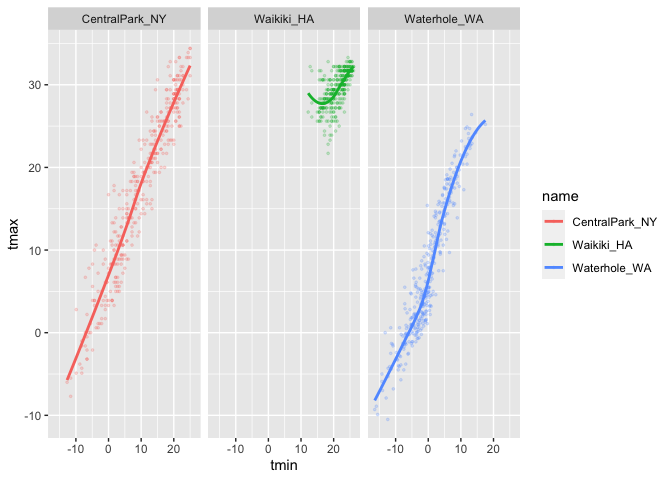<!-- -->

``` r
ggplot(weather_df, aes(x = tmin, y = tmax,alpha = tmin, color = name)) +
  geom_point() +
  geom_smooth(se = FALSE) +
  facet_grid(. ~ name)
```

    ## `geom_smooth()` using method = 'loess' and formula 'y ~ x'

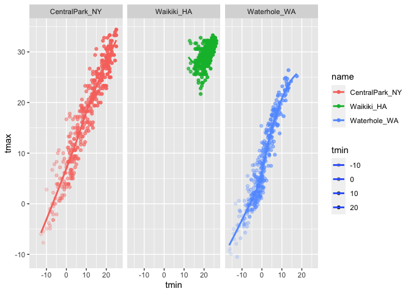<!-- -->

I’ve learned a lot about these data. However, the relationship between
min and max temperature is now kinda boring, so I’d prefer something
that shows the time of year. I also want to learn about precipitation.

``` r
ggplot(weather_df, aes(x = date, y = tmax, color = name)) +
  geom_point(aes(size = prcp), alpha = 0.5) +
  geom_smooth(se = FALSE) + 
  facet_grid(. ~ name)
```

    ## `geom_smooth()` using method = 'loess' and formula 'y ~ x'

<!-- -->

``` r
ggplot(weather_df, aes(x = date, y = tmax, color = name)) +
  geom_point(aes(size = prcp), alpha = 0.5) +
  geom_smooth(se = FALSE) + 
  facet_grid(name ~ .)
```

    ## `geom_smooth()` using method = 'loess' and formula 'y ~ x'

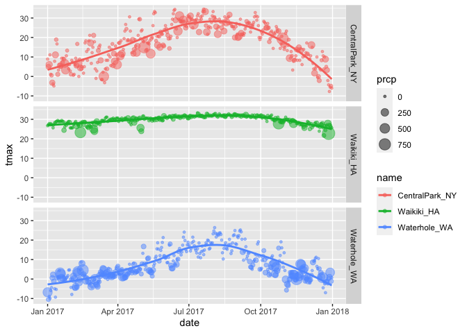<!-- -->

You can use a neat geom\!

``` r
weather_df %>% 
  ggplot(aes(x = tmin, y = tmax)) +
  geom_hex()
```

    ## Warning: Removed 15 rows containing non-finite values (stat_binhex).

    ## Warning: Computation failed in `stat_binhex()`:
    ##   Package `hexbin` required for `stat_binhex`.
    ##   Please install and try again.

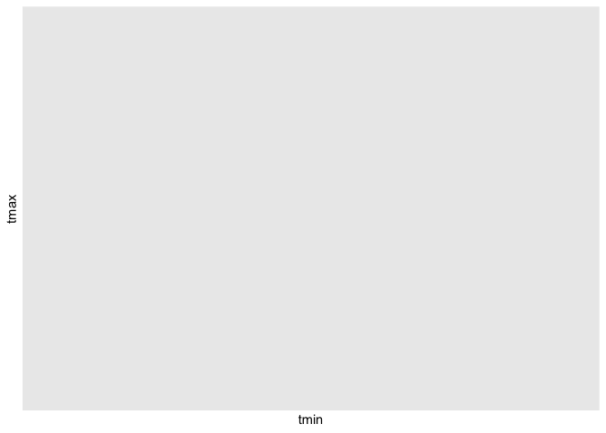<!-- -->

``` r
weather_df %>% 
  ggplot(aes(x = tmin, y = tmax)) +
  geom_bin2d()
```

    ## Warning: Removed 15 rows containing non-finite values (stat_bin2d).

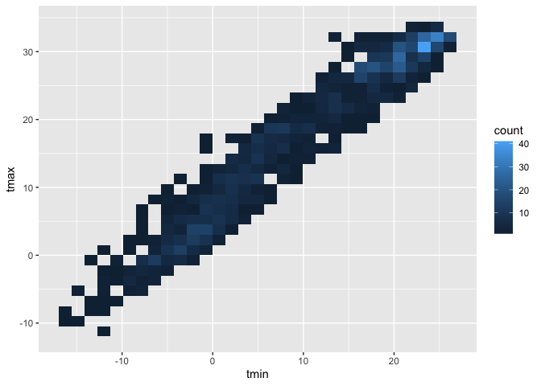<!-- -->

``` r
weather_df %>% 
  ggplot(aes(x = tmin, y = tmax)) +
  geom_density2d() + 
  geom_point(alpha = .3)
```

    ## Warning: Removed 15 rows containing non-finite values (stat_density2d).

    ## Warning: Removed 15 rows containing missing values (geom_point).

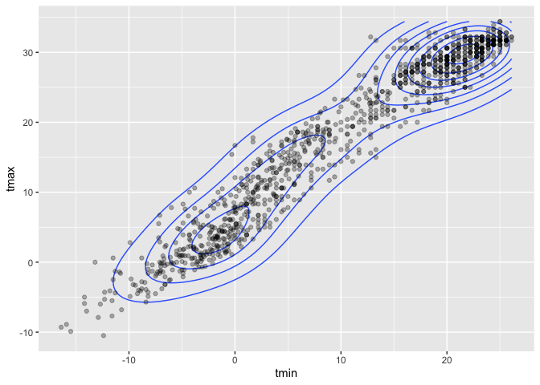<!-- -->

#### Learning Assessment 1

Write a code chain focuses only on Central park, converts temperatures
to Fahrenheit, make a scatterplot of min vs. max temperature, and
overlay a linear regression line using options in geom\_smooth()

``` r
#this is my solution
library(dplyr)
ggplot(weather_df %>% 
  filter(name == "CentralPark_NY"), 
  aes(x = tmin, y = tmax)) +
  geom_point(aes(color = name)) + 
  geom_smooth()
```

    ## `geom_smooth()` using method = 'loess' and formula 'y ~ x'

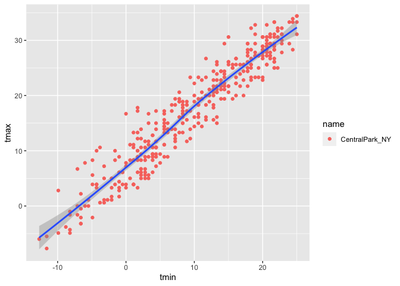<!-- -->

``` r
#this is the right solution
weather_df %>% 
  filter(name == "CentralPark_NY") %>% 
  mutate(
    tmax_fahr = tmax * (9 / 5) + 32,
    tmin_fahr = tmin * (9 / 5) + 32) %>% 
  ggplot(aes(x = tmin_fahr, y = tmax_fahr)) +
  geom_point(alpha = .5) + 
  geom_smooth(method = "lm", se = FALSE)
```

    ## `geom_smooth()` using formula 'y ~ x'

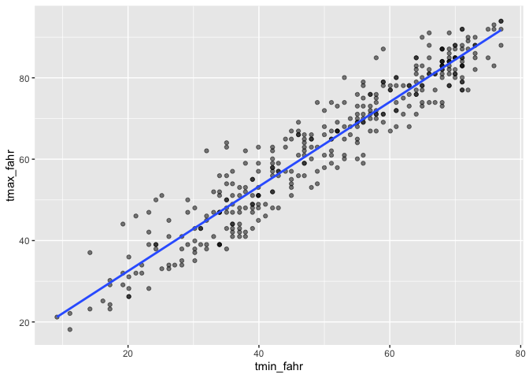<!-- -->

``` r
#Looks like there's a pretty linear relationship between min and max temperature in Central Park.
```

## Odds and Ends

``` r
# There are lots of ways to mix and match elements, depending on your goals
ggplot(weather_df, aes(x = date, y = tmax, color = name)) + 
  geom_smooth(se = FALSE) 
```

    ## `geom_smooth()` using method = 'loess' and formula 'y ~ x'

    ## Warning: Removed 3 rows containing non-finite values (stat_smooth).

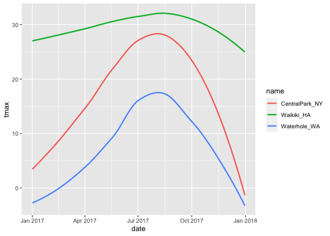<!-- -->

``` r
#When you're making scatterplot with lots of data, there's a limit to how much you can avoid overplotting using alpha levels and transparency. In these cases, `geom_hex()`, `geom_bin2d()`, or `geom_density2d()` can be handy
library(ggplot2)
ggplot(weather_df, aes(x = tmax, y = tmin)) +
  geom_hex()
```

    ## Warning: Removed 15 rows containing non-finite values (stat_binhex).

    ## Warning: Computation failed in `stat_binhex()`:
    ##   Package `hexbin` required for `stat_binhex`.
    ##   Please install and try again.

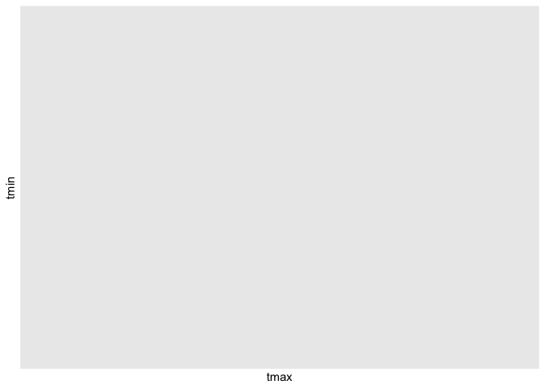<!-- -->

``` r
#`color` worked for both geom_point() and geom_smooth() but `shape` only applies to points. 
```

#### Learning Assessment 2

``` r
ggplot(weather_df) + geom_point(aes(x = tmax, y = tmin), color = "blue")
```

    ## Warning: Removed 15 rows containing missing values (geom_point).

<!-- -->

``` r
ggplot(weather_df) + geom_point(aes(x = tmax, y = tmin, color = "blue"))
```

    ## Warning: Removed 15 rows containing missing values (geom_point).

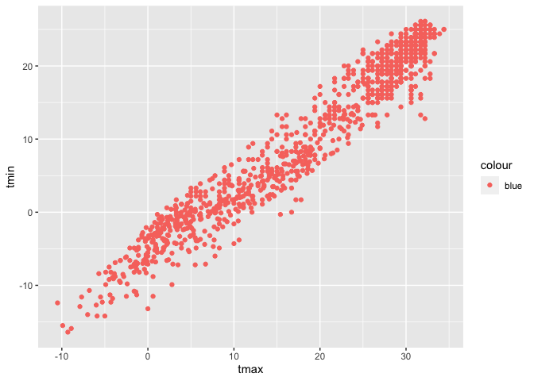<!-- -->

``` r
#These lines don't produce the same result because in the 1st attempt, we're defining the color of the points by hand; in the 2nd attempt, we're implicitly creating a color variable that has the value "blue" everywhere; ggplot is then assigning colors according to this variable using the default color scheme.
```

## Univariate plots

Look at the distribution of single variables - this is an issue of
learning some new geoms, and some new aesthetics.

``` r
ggplot(weather_df, aes(x = tmax)) + 
  geom_histogram()
```

    ## `stat_bin()` using `bins = 30`. Pick better value with `binwidth`.

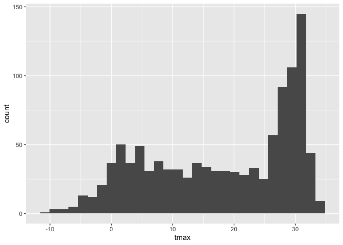<!-- -->

``` r
#Can we add color
ggplot(weather_df, aes(x = tmax, color = name)) + 
  geom_histogram()
```

    ## `stat_bin()` using `bins = 30`. Pick better value with `binwidth`.

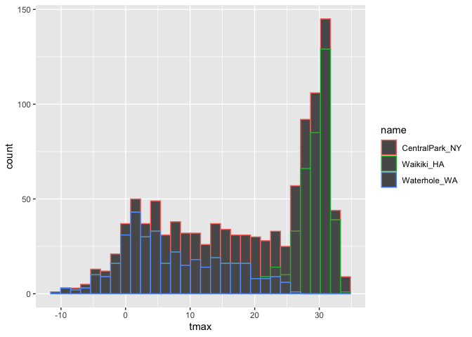<!-- -->

``` r
weather_df %>% 
  ggplot(aes(x = tmax, fill = name)) +
  geom_histogram(position = "dodge")
```

    ## `stat_bin()` using `bins = 30`. Pick better value with `binwidth`.

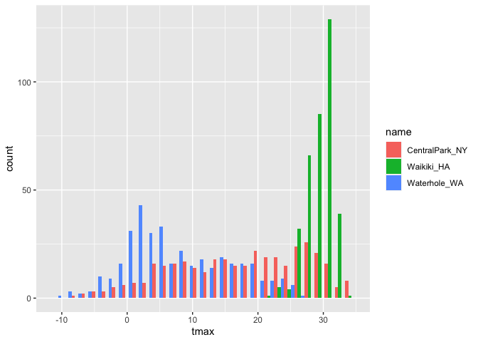<!-- -->

``` r
weather_df %>% 
  ggplot(aes(x = tmax, fill = name)) +
  geom_histogram() + 
  facet_grid(. ~ name)
```

    ## `stat_bin()` using `bins = 30`. Pick better value with `binwidth`.

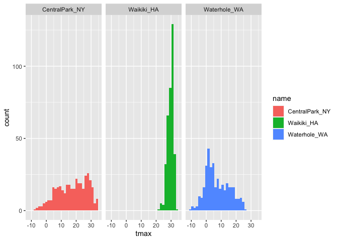<!-- -->

``` r
#Play around with bin width and set the fill color using an aesthetic mapping. 

ggplot(weather_df, aes(x = tmax, fill = name)) +
  geom_histogram(position = "dodge", binwidth = 2)
```

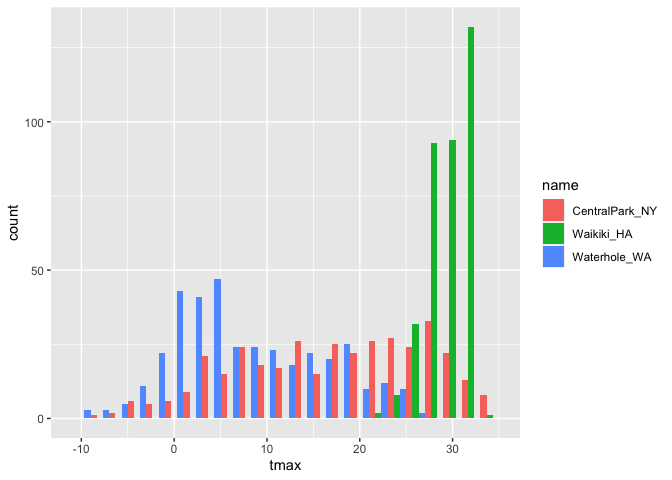<!-- -->

``` r
#`position = "dodge` places the bars for each group side-by-side, but it can be hard to understand. prefer density plots over histogram. 

ggplot(weather_df, aes(x = tmax, fill = name)) +
  geom_density(alpha = 0.4, adjust = 0.5, color = "blue")
```

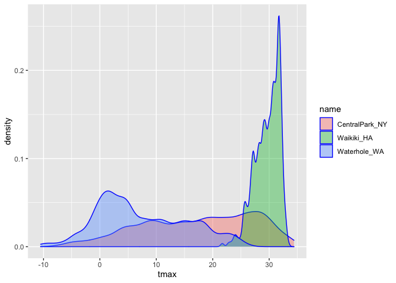<!-- -->

``` r
#`adjust` similar to `bindwidth` parameter. alpha = transparency level = 0.4 to make sure all densities appear. Lastly, adding `geom_rug()` can be helpful to show the raw data in addition to the density.

#boxplot
ggplot(weather_df, aes(x = name, y = tmax)) + geom_boxplot()
```

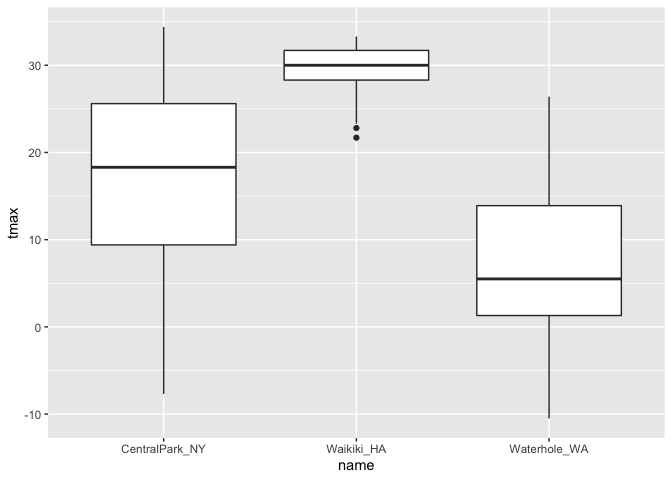<!-- -->

``` r
#violin plots
ggplot(weather_df, aes(x = name, y = tmax)) + 
  geom_violin(aes(fill = name), alpha = .5) + 
  stat_summary(fun = "mean", color = "blue", size = .2) +
  stat_summary(fun = "median", color = "red", size = .2)
```

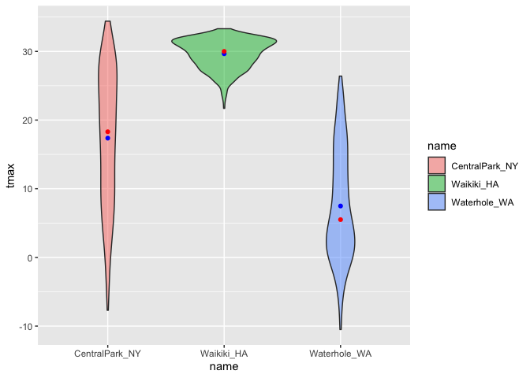<!-- -->

``` r
#ridge plots - nice if you have lots of categories in which the shape of the distribution matters. 
ggplot(weather_df, aes(x = tmax, y = name)) + 
  geom_density_ridges(scale = .85)
```

    ## Picking joint bandwidth of 1.84

<!-- -->

#### Learning Assessment 3

``` r
#Make plots that compare precipitation across location. Try histogram, density plot, boxplot, violin plot and ridgeplot

#density plot
ggplot(weather_df, aes(x = prcp)) + 
  geom_density(aes(fill = name), alpha = 0.5) 
```

    ## Warning: Removed 3 rows containing non-finite values (stat_density).

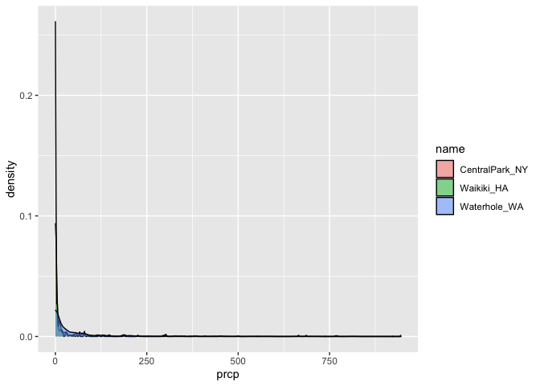<!-- -->

``` r
ggplot(weather_df, aes(x = name, y = tmax)) + 
  geom_boxplot() 
```

    ## Warning: Removed 3 rows containing non-finite values (stat_boxplot).

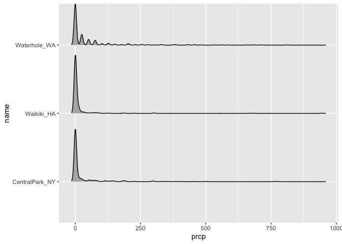<!-- -->

``` r
#ridge plot
ggplot(weather_df, aes(x = prcp, y = name)) +
  geom_density_ridges(scale = 0.85)
```

    ## Picking joint bandwidth of 4.61

    ## Warning: Removed 3 rows containing non-finite values (stat_density_ridges).

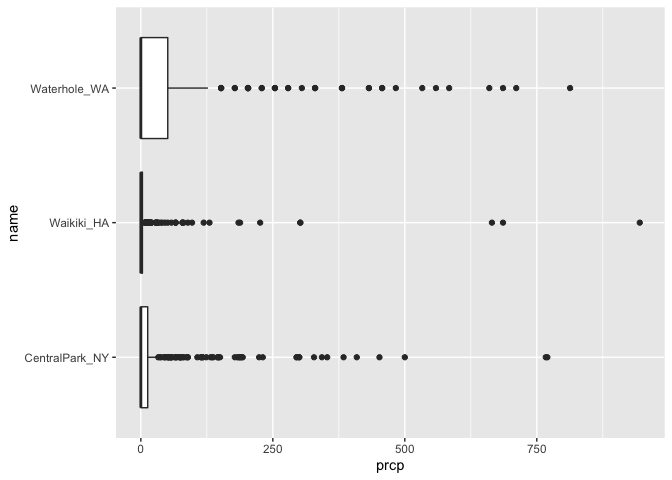<!-- -->

``` r
#boxplot
ggplot(weather_df, aes(x = prcp, y = name)) +
  geom_boxplot()
```

    ## Warning: Removed 3 rows containing non-finite values (stat_boxplot).

<!-- -->

``` r
# This is a tough variable to plot because of the highly skewed distribution in each location. Of these, I'd probably choose the boxplot because it shows the outliers most clearly. If the bulk of the data were interesting, I'd probably compliment this with a plot showing data for all precipiation less than 100, or for a data omitting days with no precipitation. 
weather_df %>% 
  filter(prcp > 0) %>% 
  ggplot(aes(x = prcp, y = name)) +
  geom_density_ridges(scale = 0.85)
```

    ## Picking joint bandwidth of 19.7

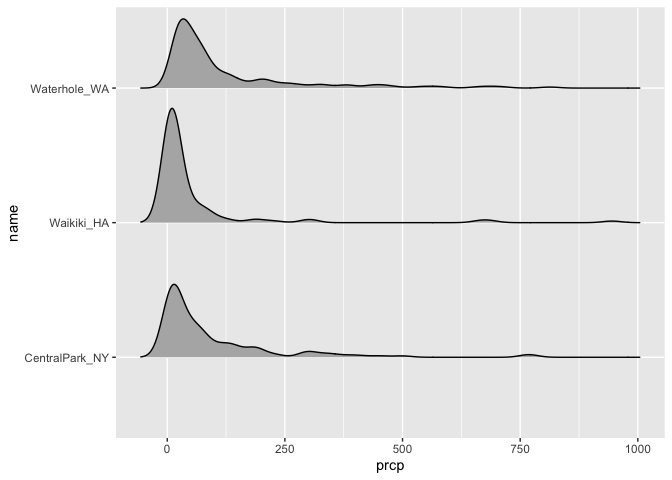<!-- -->

## Saving and embedding plots

``` r
#Don't use export function - your figure will not be reproducible 
weather_plot = ggplot(weather_df, aes(x = tmin, y = tmax)) + 
  geom_point(aes(color = name), alpha = .5) 

ggsave("weather_plot.pdf", weather_plot, width = 8, height = 5)
```

    ## Warning: Removed 15 rows containing missing values (geom_point).

``` r
#Embedding plots: The size of the figure created by R is controlled using 2 of the 3 chunk options `fig.width`, `fig.height`, `fig.asp`. Second is the size of the figure inserted into your document, which is controlled using `out.width` or `out.height`. 

knitr::opts_chunk$set(
  fig.width = 6,
  fig.asp = .6,
  out.width = "90%"
)
```

\#Embed at different size

``` r
weather_plot
```

    ## Warning: Removed 15 rows containing missing values (geom_point).

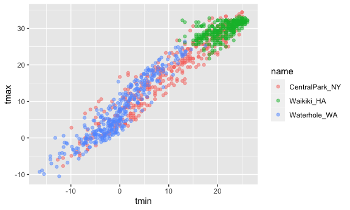

``` r
weather_plot
```

    ## Warning: Removed 15 rows containing missing values (geom_point).

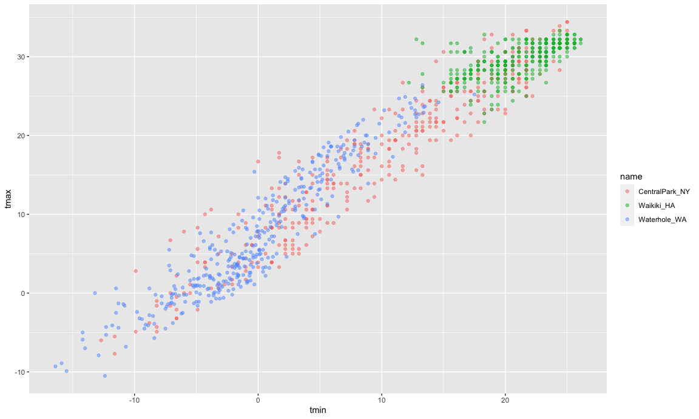

# Visualization with `ggplot2` - Part II

``` r
library(patchwork)
```

Revisit the scatterplot of tmax against tmin

``` r
weather_df %>% 
  ggplot(aes(x = tmin, y = tmax, color = name)) + 
  geom_point(alpha = .5)
```

    ## Warning: Removed 15 rows containing missing values (geom_point).


#### Labels

``` r
weather_df %>% 
  ggplot(aes(x = tmin, y = tmax)) + 
  geom_point(aes(color = name), alpha = .5) + 
  labs(
    title = "Temperature plot",
    x = "Minimum daily temperature (C)",
    y = "Maxiumum daily temperature (C)",
    caption = "Data from the rnoaa package"
  )
```

    ## Warning: Removed 15 rows containing missing values (geom_point).

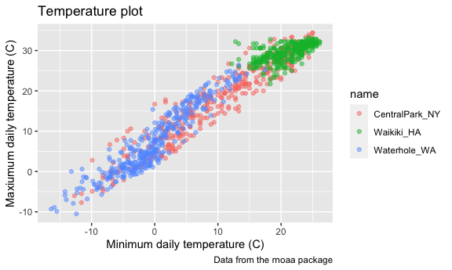

#### Scales

Control over the location and specification of tick marks on the X or Y
axis - You can use `scale_x_*` and `scale_y_*` where \* depends on the
type of variable (i.e. continuous vs discrete)

x and y scales

``` r
weather_df %>% 
  ggplot(aes(x = tmin, y = tmax)) + 
  geom_point(aes(color = name), alpha = .5) + 
  labs(
    title = "Temperature plot",
    x = "Minimum daily temperature (C)",
    y = "Maxiumum daily temperature (C)",
    caption = "Data from the rnoaa package") + 
  scale_x_continuous(
    breaks = c(-15, 0, 15), 
    labels = c("-15º C", "0", "15"))
```

    ## Warning: Removed 15 rows containing missing values (geom_point).

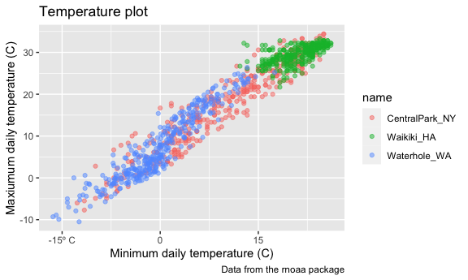

``` r
weather_df %>% 
  ggplot(aes(x = tmin, y = tmax)) + 
  geom_point(aes(color = name), alpha = .5) + 
  labs(
    title = "Temperature plot",
    x = "Minimum daily temperature (C)",
    y = "Maxiumum daily temperature (C)",
    caption = "Data from the rnoaa package") + 
  scale_x_continuous(
    breaks = c(-15, 0, 15), 
    labels = c("-15ºC", "0", "15"),
    limits = c(-20, 30)) + 
  scale_y_continuous(
    trans = "sqrt", 
    position = "right")
```

    ## Warning in self$trans$transform(x): NaNs produced

    ## Warning: Transformation introduced infinite values in continuous y-axis

    ## Warning: Removed 90 rows containing missing values (geom_point).

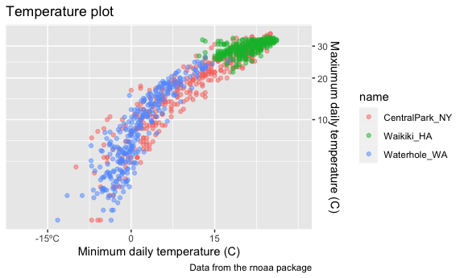

Let’s look at `scale_color_hue`

``` r
weather_df %>% 
  ggplot(aes(x = tmin, y = tmax)) + 
  geom_point(aes(color = name), alpha = .5) + 
  labs(
    title = "Temperature plot",
    x = "Minimum daily temperature (C)",
    y = "Maxiumum daily temperature (C)",
    caption = "Data from the rnoaa package") + 
  scale_color_hue(name = "Location", h = c(100, 300))
```

    ## Warning: Removed 15 rows containing missing values (geom_point).


#### Viridis package

``` r
ggp_temp_plot = 
  weather_df %>% 
  ggplot(aes(x = tmin, y = tmax)) + 
  geom_point(aes(color = name), alpha = .5) + 
  labs(
    title = "Temperature plot",
    x = "Minimum daily temperature (C)",
    y = "Maxiumum daily temperature (C)",
    caption = "Data from the rnoaa package"
  ) + 
  viridis::scale_color_viridis(
    name = "Location", 
    discrete = TRUE
  )

ggp_temp_plot
```

    ## Warning: Removed 15 rows containing missing values (geom_point).

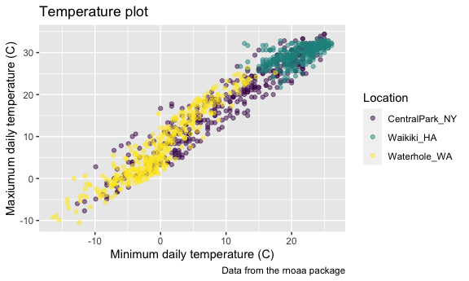

#### Themes

Shift the legend

``` r
ggp_temp_plot + 
  theme(legend.position = "bottom") 
```

    ## Warning: Removed 15 rows containing missing values (geom_point).


Change the overall theme (background)

``` r
ggp_temp_plot + theme_bw()
```

    ## Warning: Removed 15 rows containing missing values (geom_point).

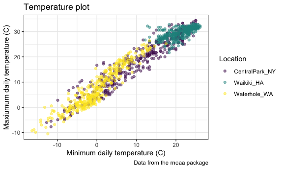

``` r
ggp_temp_plot + theme_minimal()
```

    ## Warning: Removed 15 rows containing missing values (geom_point).


``` r
ggp_temp_plot + theme_classic()
```

    ## Warning: Removed 15 rows containing missing values (geom_point).


``` r
ggp_temp_plot = 
  weather_df %>% 
  ggplot(aes(x = tmin, y = tmax)) + 
  geom_point(aes(color = name), alpha = .5) + 
  labs(
    title = "Temperature plot",
    x = "Minimum daily temperature (C)",
    y = "Maxiumum daily temperature (C)",
    caption = "Data from the rnoaa package"
  ) + 
  viridis::scale_color_viridis(
    name = "Location", 
    discrete = TRUE) +
  theme_minimal() +
  theme(legend.position = "bottom")
```

#### Setting options

These are options that I will put at the very beginning

``` r
library(tidyverse)

knitr::opts_chunk$set(
  fig.width = 6,
  fig.asp = .6  #height/width
  out.width = "90%"
)

theme_set(theme_minimal() + theme(legend.position = "bottom")) #determine theme i want to exist everywhere

options(
  ggplot2.continuous.colour = "viridis",
  ggplot2.continuous.fill = "viridis"
)

scale_colour_discrete = scale_color_viridis_d
scale_colour_continuous = scale_color_viridis_c
```

#### Data arguments in `geom`

``` r
central_park = 
  weather_df %>% 
  filter(name == "CentralPark_NY")

waikiki = 
  weather_df %>% 
  filter(name == "Waikiki_HA")

ggplot(data = waikiki, aes(x = date, y = tmax, color = name)) +
  geom_point() +
  geom_line()
```

    ## Warning: Removed 3 rows containing missing values (geom_point).

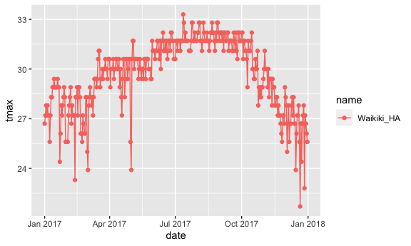

``` r
ggplot(data = waikiki, aes(x = date, y = tmax, color = name)) +
  geom_point() +
  geom_line(data = central_park)
```

    ## Warning: Removed 3 rows containing missing values (geom_point).


#### `patchwork`

Remember faceting?

``` r
weather_df %>% 
  ggplot(aes(x = tmin, fill = name)) +
  geom_density(alpha = .5) +
  facet_grid(.~name)
```

    ## Warning: Removed 15 rows containing non-finite values (stat_density).

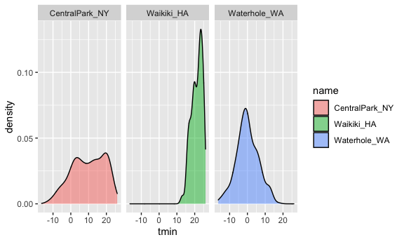

What happens when you want multipanel plots but can’t facet..?

``` r
tmax_tmin_plot =
  weather_df %>% 
  ggplot(aes(x = tmin, y = tmax, color = name)) +
  geom_point(alpha =.5) +
  theme(legend.position = "none")

prcp_dens_plot =
  weather_df %>% 
  filter(prcp > 0) %>% 
  ggplot(aes(x = prcp, fill = name)) +
  geom_density(alpha =.5) +
  theme(legend.position = "none")

tmax_date_plot = 
  weather_df %>% 
  ggplot(aes(x = date, y = tmax, color = name)) +
  geom_point() +
  geom_smooth(se = FALSE) +
  theme(legend.position = "none")

tmax_tmin_plot + prcp_dens_plot 
```

    ## Warning: Removed 15 rows containing missing values (geom_point).

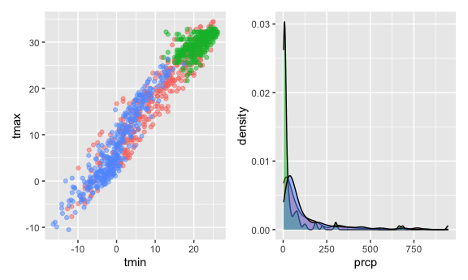

``` r
tmax_tmin_plot + prcp_dens_plot + tmax_date_plot
```

    ## Warning: Removed 15 rows containing missing values (geom_point).

    ## `geom_smooth()` using method = 'loess' and formula 'y ~ x'

    ## Warning: Removed 3 rows containing non-finite values (stat_smooth).

    ## Warning: Removed 3 rows containing missing values (geom_point).

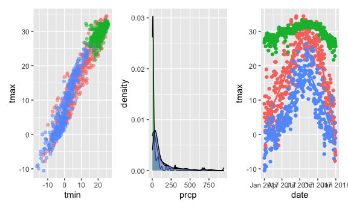

``` r
(tmax_tmin_plot + prcp_dens_plot) / tmax_date_plot
```

    ## Warning: Removed 15 rows containing missing values (geom_point).

    ## `geom_smooth()` using method = 'loess' and formula 'y ~ x'

    ## Warning: Removed 3 rows containing non-finite values (stat_smooth).
    
    ## Warning: Removed 3 rows containing missing values (geom_point).

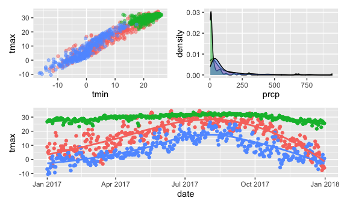

#### Data manipulation

``` r
weather_df %>% 
  ggplot(aes(x = name, y = tmax, fill = name)) +
  geom_violin(alpha =.5)
```

    ## Warning: Removed 3 rows containing non-finite values (stat_ydensity).

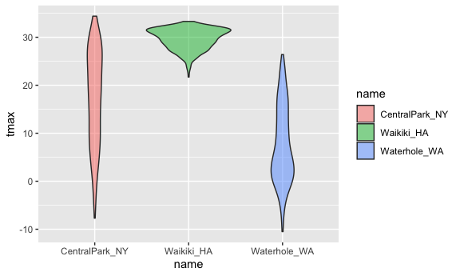

name argument might not make perfect sense. It goes in alphabetical
order according to the name. In the dataset I have, the name variable is
character. When make plot, ggplot turns character variable to factor (1
= central park, 2 = waikiki, 3 = waterhole) and if I want to put them
into different order, is there a way to overwrite that?

Control your factors

``` r
weather_df %>% 
  mutate(
    name = factor(name),
    name = forcats::fct_relevel(name, c("Waikiki_HA"))
  ) %>% 
  ggplot(aes(x = name, y = tmax, fill = name)) +
  geom_violin(alpha =.5)
```

    ## Warning: Removed 3 rows containing non-finite values (stat_ydensity).

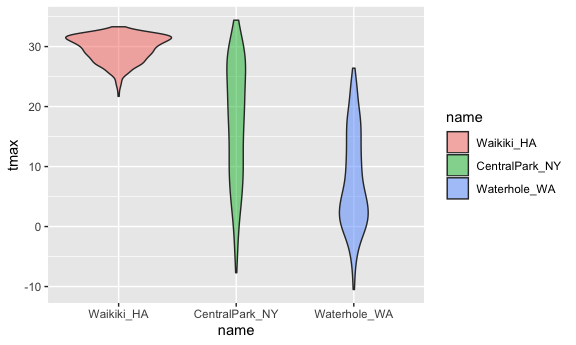

What if I wanted densities for tmin and tmax simultaneously?

``` r
weather_df %>% 
  filter(name == "CentralPark_NY") %>% 
  pivot_longer(
    tmax:tmin,
    names_to = "observation",
    values_to = "temperature"
  ) %>% 
  ggplot(aes(x = temperature, fill = observation)) +
  geom_density(alpha =.5) 
```

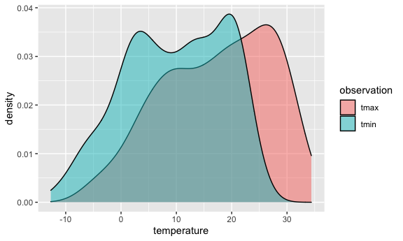

``` r
weather_df %>% 
  pivot_longer(
    tmax:tmin,
    names_to = "observation",
    values_to = "temperature"
  ) %>% 
  ggplot(aes(x = temperature, fill = observation)) +
  geom_density(alpha =.5) +
  facet_grid(.~name)
```

    ## Warning: Removed 18 rows containing non-finite values (stat_density).

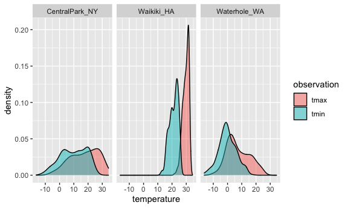

#### Revisiting the pups

``` r
pups_data = 
  read_csv("data/FAS_pups.csv") %>% 
  janitor::clean_names() %>% 
  mutate(sex = recode(sex, `1` = "male", `2` = "female"))
```

    ## Parsed with column specification:
    ## cols(
    ##   `Litter Number` = col_character(),
    ##   Sex = col_double(),
    ##   `PD ears` = col_double(),
    ##   `PD eyes` = col_double(),
    ##   `PD pivot` = col_double(),
    ##   `PD walk` = col_double()
    ## )

``` r
litters_data = 
  read_csv("data/FAS_litters.csv") %>% 
  janitor::clean_names() %>% 
  separate(group, into = c("dose", "day_of_tx"), sep = 3)
```

    ## Parsed with column specification:
    ## cols(
    ##   Group = col_character(),
    ##   `Litter Number` = col_character(),
    ##   `GD0 weight` = col_double(),
    ##   `GD18 weight` = col_double(),
    ##   `GD of Birth` = col_double(),
    ##   `Pups born alive` = col_double(),
    ##   `Pups dead @ birth` = col_double(),
    ##   `Pups survive` = col_double()
    ## )

``` r
fas_data = left_join(pups_data, litters_data, by = "litter_number")

fas_data %>% 
  ggplot(aes(x = dose, y = pd_ears)) +
  geom_violin() +
  facet_grid(. ~ day_of_tx)
```

    ## Warning: Removed 18 rows containing non-finite values (stat_ydensity).

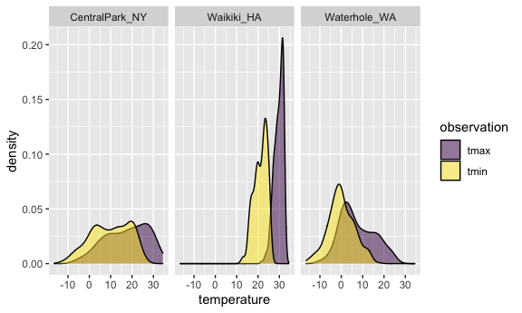

``` r
fas_data %>% 
  select(dose, day_of_tx, starts_with("pd_")) %>% 
  pivot_longer(
    pd_ears:pd_walk,
    names_to = "outcome",
    values_to = "pn_day"
  ) %>% 
  drop_na() %>% 
  mutate(outcome = forcats::fct_relevel(outcome, "pd_ears", "pd_pivot", "pd_walk", "pd_eyes")) %>% 
  ggplot(aes(x = dose, y = pn_day)) +
  geom_violin() +
  facet_grid(day_of_tx ~ outcome)
```


``` r
fas_data %>% 
  select(sex, dose, day_of_tx, pd_ears:pd_walk) %>% 
  pivot_longer(
    pd_ears:pd_walk,
    names_to = "outcome", 
    values_to = "pn_day") %>% 
  drop_na() %>% 
  mutate(outcome = forcats::fct_reorder(outcome, pn_day, median)) %>% 
  ggplot(aes(x = dose, y = pn_day)) + 
  geom_violin() + 
  facet_grid(day_of_tx ~ outcome)
```

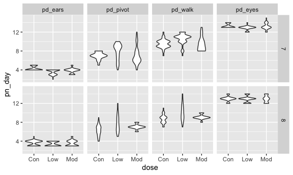

# Exploratory analysis using data summaries

Load the weather data including month

``` r
weather_df =  
  rnoaa::meteo_pull_monitors(
    c("USW00094728", "USC00519397", "USS0023B17S"),
    var = c("PRCP", "TMIN", "TMAX"), 
    date_min = "2017-01-01",
    date_max = "2017-12-31") %>%
  mutate(
    name = recode(
      id, 
      USW00094728 = "CentralPark_NY", 
      USC00519397 = "Waikiki_HA",
      USS0023B17S = "Waterhole_WA"),
    tmin = tmin / 10,
    tmax = tmax / 10,
    month = lubridate::floor_date(date, unit = "month")) %>%
  select(name, id, everything())
```

    ## using cached file: /Users/linhmaitran/Library/Caches/R/noaa_ghcnd/USW00094728.dly

    ## date created (size, mb): 2020-10-05 10:25:47 (7.522)

    ## file min/max dates: 1869-01-01 / 2020-10-31

    ## using cached file: /Users/linhmaitran/Library/Caches/R/noaa_ghcnd/USC00519397.dly

    ## date created (size, mb): 2020-10-05 10:25:55 (1.699)

    ## file min/max dates: 1965-01-01 / 2020-03-31

    ## using cached file: /Users/linhmaitran/Library/Caches/R/noaa_ghcnd/USS0023B17S.dly

    ## date created (size, mb): 2020-10-05 10:25:59 (0.88)

    ## file min/max dates: 1999-09-01 / 2020-10-31

#### group\_by() makes grouping explicit and adds a layer to your data

``` r
weather_df %>% 
  group_by(name)
```

    ## # A tibble: 1,095 x 7
    ## # Groups:   name [3]
    ##    name           id          date        prcp  tmax  tmin month     
    ##    <chr>          <chr>       <date>     <dbl> <dbl> <dbl> <date>    
    ##  1 CentralPark_NY USW00094728 2017-01-01     0   8.9   4.4 2017-01-01
    ##  2 CentralPark_NY USW00094728 2017-01-02    53   5     2.8 2017-01-01
    ##  3 CentralPark_NY USW00094728 2017-01-03   147   6.1   3.9 2017-01-01
    ##  4 CentralPark_NY USW00094728 2017-01-04     0  11.1   1.1 2017-01-01
    ##  5 CentralPark_NY USW00094728 2017-01-05     0   1.1  -2.7 2017-01-01
    ##  6 CentralPark_NY USW00094728 2017-01-06    13   0.6  -3.8 2017-01-01
    ##  7 CentralPark_NY USW00094728 2017-01-07    81  -3.2  -6.6 2017-01-01
    ##  8 CentralPark_NY USW00094728 2017-01-08     0  -3.8  -8.8 2017-01-01
    ##  9 CentralPark_NY USW00094728 2017-01-09     0  -4.9  -9.9 2017-01-01
    ## 10 CentralPark_NY USW00094728 2017-01-10     0   7.8  -6   2017-01-01
    ## # … with 1,085 more rows

``` r
weather_df %>% 
  group_by(name, month)
```

    ## # A tibble: 1,095 x 7
    ## # Groups:   name, month [36]
    ##    name           id          date        prcp  tmax  tmin month     
    ##    <chr>          <chr>       <date>     <dbl> <dbl> <dbl> <date>    
    ##  1 CentralPark_NY USW00094728 2017-01-01     0   8.9   4.4 2017-01-01
    ##  2 CentralPark_NY USW00094728 2017-01-02    53   5     2.8 2017-01-01
    ##  3 CentralPark_NY USW00094728 2017-01-03   147   6.1   3.9 2017-01-01
    ##  4 CentralPark_NY USW00094728 2017-01-04     0  11.1   1.1 2017-01-01
    ##  5 CentralPark_NY USW00094728 2017-01-05     0   1.1  -2.7 2017-01-01
    ##  6 CentralPark_NY USW00094728 2017-01-06    13   0.6  -3.8 2017-01-01
    ##  7 CentralPark_NY USW00094728 2017-01-07    81  -3.2  -6.6 2017-01-01
    ##  8 CentralPark_NY USW00094728 2017-01-08     0  -3.8  -8.8 2017-01-01
    ##  9 CentralPark_NY USW00094728 2017-01-09     0  -4.9  -9.9 2017-01-01
    ## 10 CentralPark_NY USW00094728 2017-01-10     0   7.8  -6   2017-01-01
    ## # … with 1,085 more rows

``` r
weather_df %>% 
  group_by(name, month) %>% 
  ungroup()
```

    ## # A tibble: 1,095 x 7
    ##    name           id          date        prcp  tmax  tmin month     
    ##    <chr>          <chr>       <date>     <dbl> <dbl> <dbl> <date>    
    ##  1 CentralPark_NY USW00094728 2017-01-01     0   8.9   4.4 2017-01-01
    ##  2 CentralPark_NY USW00094728 2017-01-02    53   5     2.8 2017-01-01
    ##  3 CentralPark_NY USW00094728 2017-01-03   147   6.1   3.9 2017-01-01
    ##  4 CentralPark_NY USW00094728 2017-01-04     0  11.1   1.1 2017-01-01
    ##  5 CentralPark_NY USW00094728 2017-01-05     0   1.1  -2.7 2017-01-01
    ##  6 CentralPark_NY USW00094728 2017-01-06    13   0.6  -3.8 2017-01-01
    ##  7 CentralPark_NY USW00094728 2017-01-07    81  -3.2  -6.6 2017-01-01
    ##  8 CentralPark_NY USW00094728 2017-01-08     0  -3.8  -8.8 2017-01-01
    ##  9 CentralPark_NY USW00094728 2017-01-09     0  -4.9  -9.9 2017-01-01
    ## 10 CentralPark_NY USW00094728 2017-01-10     0   7.8  -6   2017-01-01
    ## # … with 1,085 more rows

#### Counting things

Count month/ name observation

``` r
weather_df %>% 
  group_by(month) %>% 
  summarize(n_obs = n())
```

    ## `summarise()` ungrouping output (override with `.groups` argument)

    ## # A tibble: 12 x 2
    ##    month      n_obs
    ##    <date>     <int>
    ##  1 2017-01-01    93
    ##  2 2017-02-01    84
    ##  3 2017-03-01    93
    ##  4 2017-04-01    90
    ##  5 2017-05-01    93
    ##  6 2017-06-01    90
    ##  7 2017-07-01    93
    ##  8 2017-08-01    93
    ##  9 2017-09-01    90
    ## 10 2017-10-01    93
    ## 11 2017-11-01    90
    ## 12 2017-12-01    93

``` r
weather_df %>% 
  group_by(name, month) %>% 
  summarize(n_obs = n())
```

    ## `summarise()` regrouping output by 'name' (override with `.groups` argument)

    ## # A tibble: 36 x 3
    ## # Groups:   name [3]
    ##    name           month      n_obs
    ##    <chr>          <date>     <int>
    ##  1 CentralPark_NY 2017-01-01    31
    ##  2 CentralPark_NY 2017-02-01    28
    ##  3 CentralPark_NY 2017-03-01    31
    ##  4 CentralPark_NY 2017-04-01    30
    ##  5 CentralPark_NY 2017-05-01    31
    ##  6 CentralPark_NY 2017-06-01    30
    ##  7 CentralPark_NY 2017-07-01    31
    ##  8 CentralPark_NY 2017-08-01    31
    ##  9 CentralPark_NY 2017-09-01    30
    ## 10 CentralPark_NY 2017-10-01    31
    ## # … with 26 more rows

We can also use `count()`

``` r
weather_df %>% 
  count(month, name = "n_obs")
```

    ## # A tibble: 12 x 2
    ##    month      n_obs
    ##    <date>     <int>
    ##  1 2017-01-01    93
    ##  2 2017-02-01    84
    ##  3 2017-03-01    93
    ##  4 2017-04-01    90
    ##  5 2017-05-01    93
    ##  6 2017-06-01    90
    ##  7 2017-07-01    93
    ##  8 2017-08-01    93
    ##  9 2017-09-01    90
    ## 10 2017-10-01    93
    ## 11 2017-11-01    90
    ## 12 2017-12-01    93

``` r
weather_df %>% 
  count(name, month, name = "n_obs")
```

    ## # A tibble: 36 x 3
    ##    name           month      n_obs
    ##    <chr>          <date>     <int>
    ##  1 CentralPark_NY 2017-01-01    31
    ##  2 CentralPark_NY 2017-02-01    28
    ##  3 CentralPark_NY 2017-03-01    31
    ##  4 CentralPark_NY 2017-04-01    30
    ##  5 CentralPark_NY 2017-05-01    31
    ##  6 CentralPark_NY 2017-06-01    30
    ##  7 CentralPark_NY 2017-07-01    31
    ##  8 CentralPark_NY 2017-08-01    31
    ##  9 CentralPark_NY 2017-09-01    30
    ## 10 CentralPark_NY 2017-10-01    31
    ## # … with 26 more rows

**NEVER** use base R’s `table`.

``` r
weather_df %>% 
  pull(month) %>% 
  table()
```

Other helpful counters

``` r
weather_df %>% 
  group_by(month) %>% 
  summarize(
    n_obs = n(),
    n_days = n_distinct(date)
  )
```

    ## `summarise()` ungrouping output (override with `.groups` argument)

    ## # A tibble: 12 x 3
    ##    month      n_obs n_days
    ##    <date>     <int>  <int>
    ##  1 2017-01-01    93     31
    ##  2 2017-02-01    84     28
    ##  3 2017-03-01    93     31
    ##  4 2017-04-01    90     30
    ##  5 2017-05-01    93     31
    ##  6 2017-06-01    90     30
    ##  7 2017-07-01    93     31
    ##  8 2017-08-01    93     31
    ##  9 2017-09-01    90     30
    ## 10 2017-10-01    93     31
    ## 11 2017-11-01    90     30
    ## 12 2017-12-01    93     31

A digression on 2x2 table

``` r
weather_df  %>% 
  filter(name != "Waikiki_HA") %>% 
  mutate(
    cold = case_when(
      tmax < 5 ~ "cold",
      tmax >= 5 ~ "not cold",
      TRUE ~ ""
    )
  ) 
```

    ## # A tibble: 730 x 8
    ##    name           id          date        prcp  tmax  tmin month      cold    
    ##    <chr>          <chr>       <date>     <dbl> <dbl> <dbl> <date>     <chr>   
    ##  1 CentralPark_NY USW00094728 2017-01-01     0   8.9   4.4 2017-01-01 not cold
    ##  2 CentralPark_NY USW00094728 2017-01-02    53   5     2.8 2017-01-01 not cold
    ##  3 CentralPark_NY USW00094728 2017-01-03   147   6.1   3.9 2017-01-01 not cold
    ##  4 CentralPark_NY USW00094728 2017-01-04     0  11.1   1.1 2017-01-01 not cold
    ##  5 CentralPark_NY USW00094728 2017-01-05     0   1.1  -2.7 2017-01-01 cold    
    ##  6 CentralPark_NY USW00094728 2017-01-06    13   0.6  -3.8 2017-01-01 cold    
    ##  7 CentralPark_NY USW00094728 2017-01-07    81  -3.2  -6.6 2017-01-01 cold    
    ##  8 CentralPark_NY USW00094728 2017-01-08     0  -3.8  -8.8 2017-01-01 cold    
    ##  9 CentralPark_NY USW00094728 2017-01-09     0  -4.9  -9.9 2017-01-01 cold    
    ## 10 CentralPark_NY USW00094728 2017-01-10     0   7.8  -6   2017-01-01 not cold
    ## # … with 720 more rows

#### summarize() allows you to compute one-number summaries
