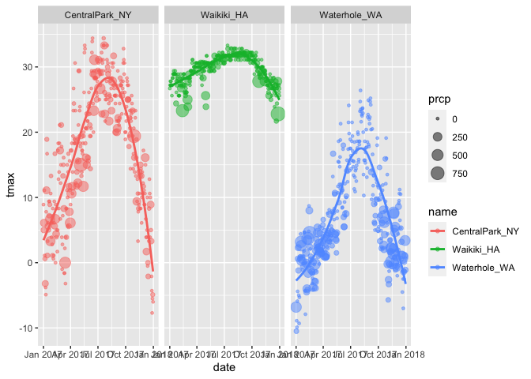
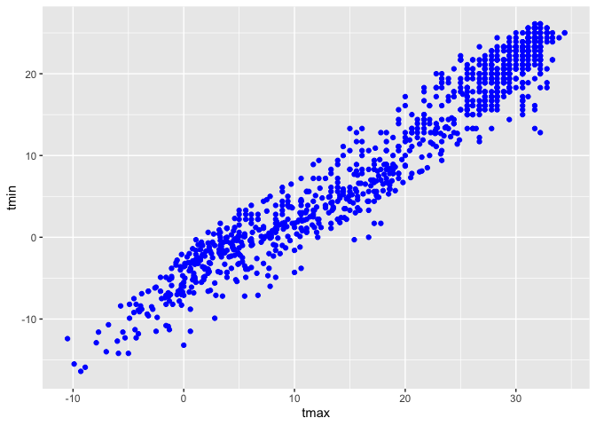

Visualization and EDA
================
Linh Tran
10/5/2020

``` r
library(tidyverse)
```

    ## ── Attaching packages ────────────────────────────────────────────────────────────────────────────────────── tidyverse 1.3.0 ──

    ## ✓ ggplot2 3.3.2     ✓ purrr   0.3.4
    ## ✓ tibble  3.0.3     ✓ dplyr   1.0.2
    ## ✓ tidyr   1.1.2     ✓ stringr 1.4.0
    ## ✓ readr   1.3.1     ✓ forcats 0.5.0

    ## ── Conflicts ───────────────────────────────────────────────────────────────────────────────────────── tidyverse_conflicts() ──
    ## x dplyr::filter() masks stats::filter()
    ## x dplyr::lag()    masks stats::lag()

``` r
library(ggridges)
```

``` r
#Creating a df using meteo_pull_monitors in the `rnoaa` package

weather_df = 
  rnoaa::meteo_pull_monitors(
    c("USW00094728", "USC00519397", "USS0023B17S"),
    var = c("PRCP", "TMIN", "TMAX"), 
    date_min = "2017-01-01",
    date_max = "2017-12-31") %>%
  mutate(
    name = recode(
      id, 
      USW00094728 = "CentralPark_NY", 
      USC00519397 = "Waikiki_HA",
      USS0023B17S = "Waterhole_WA"),
    tmin = tmin / 10,
    tmax = tmax / 10) %>%
  select(name, id, everything())
```

    ## Registered S3 method overwritten by 'hoardr':
    ##   method           from
    ##   print.cache_info httr

    ## using cached file: /Users/linhmaitran/Library/Caches/R/noaa_ghcnd/USW00094728.dly

    ## date created (size, mb): 2020-10-05 10:25:47 (7.522)

    ## file min/max dates: 1869-01-01 / 2020-10-31

    ## using cached file: /Users/linhmaitran/Library/Caches/R/noaa_ghcnd/USC00519397.dly

    ## date created (size, mb): 2020-10-05 10:25:55 (1.699)

    ## file min/max dates: 1965-01-01 / 2020-03-31

    ## using cached file: /Users/linhmaitran/Library/Caches/R/noaa_ghcnd/USS0023B17S.dly

    ## date created (size, mb): 2020-10-05 10:25:59 (0.88)

    ## file min/max dates: 1999-09-01 / 2020-10-31

``` r
weather_df
```

    ## # A tibble: 1,095 x 6
    ##    name           id          date        prcp  tmax  tmin
    ##    <chr>          <chr>       <date>     <dbl> <dbl> <dbl>
    ##  1 CentralPark_NY USW00094728 2017-01-01     0   8.9   4.4
    ##  2 CentralPark_NY USW00094728 2017-01-02    53   5     2.8
    ##  3 CentralPark_NY USW00094728 2017-01-03   147   6.1   3.9
    ##  4 CentralPark_NY USW00094728 2017-01-04     0  11.1   1.1
    ##  5 CentralPark_NY USW00094728 2017-01-05     0   1.1  -2.7
    ##  6 CentralPark_NY USW00094728 2017-01-06    13   0.6  -3.8
    ##  7 CentralPark_NY USW00094728 2017-01-07    81  -3.2  -6.6
    ##  8 CentralPark_NY USW00094728 2017-01-08     0  -3.8  -8.8
    ##  9 CentralPark_NY USW00094728 2017-01-09     0  -4.9  -9.9
    ## 10 CentralPark_NY USW00094728 2017-01-10     0   7.8  -6  
    ## # … with 1,085 more rows

# Visualization with `ggplot2` - Part I

## Basic scatterplot

To create a basic scatterplot, need to map variables to the X and Y
coordinate aesthetics, add geoms to define

``` r
ggplot(weather_df, aes(x = tmin, y = tmax)) + geom_point()
```

<!-- -->

``` r
#New approach, same plot:

weather_df %>% 
  ggplot(aes(x = tmin, y = tmax)) +
  geom_point()
```

<!-- -->

``` r
#save the output to an object and modify/print later:

plot_weather = 
  weather_df %>% 
  ggplot(aes(x = tmin, y = tmax)) 

plot_weather + geom_point()
```

<!-- --> The
basic scatterplot gave some useful information - the variables are
related roughly as we’d expect, and there aren’t any obvious outliers to
investigate before moving on.

## Advanced scatterplot - additional aesthetic mappings

`name` can be incorporated using the `color` aesthetic

``` r
ggplot(weather_df, aes(x = tmin, y = tmax, color = name)) +
  geom_point() +
  geom_smooth(se = FALSE)
```

    ## `geom_smooth()` using method = 'loess' and formula 'y ~ x'

<!-- -->

``` r
#`name` can be incorporated using the `color` aesthetic

ggplot(weather_df, aes(x = tmin, y = tmax)) +
  geom_point(aes(color = name))
```

<!-- -->

``` r
#add a smooth curve and make the data points more transparent.
ggplot(weather_df, aes(x = tmin, y = tmax)) +
  geom_point(aes(color = name), alpha = 0.5) +
  geom_smooth(se = FALSE)
```

    ## `geom_smooth()` using method = 'gam' and formula 'y ~ s(x, bs = "cs")'

<!-- --> The
curve gives a sense of the relationship between variables, and the
transparency shows where data are overlapping. However, the smooth curve
is for all the data but the colors are only for the scatterplot. That is
because X and Y mappings apply to the whole graphic, but color is
currently geom-specific. I am having a hard time seeing everything on
one plot, so I’m going to add facet based on name as well.

``` r
#add facet based on name

ggplot(weather_df, aes(x = tmin, y = tmax)) +
  geom_point(aes(color = name), alpha = 0.5) +
  geom_smooth(se = FALSE) +
  facet_grid(. ~ name)
```

    ## `geom_smooth()` using method = 'loess' and formula 'y ~ x'

<!-- -->

``` r
ggplot(weather_df, aes(x = tmin, y = tmax, color = name)) +
  geom_point(alpha = .2, size = 0.6) +      #alpha =.5 equals to 50% transparency
  geom_smooth(se = FALSE) +
  facet_grid(. ~ name)
```

    ## `geom_smooth()` using method = 'loess' and formula 'y ~ x'

<!-- -->

``` r
ggplot(weather_df, aes(x = tmin, y = tmax,alpha = tmin, color = name)) +
  geom_point() +
  geom_smooth(se = FALSE) +
  facet_grid(. ~ name)
```

    ## `geom_smooth()` using method = 'loess' and formula 'y ~ x'

<!-- -->

I’ve learned a lot about these data. However, the relationship between
min and max temperature is now kinda boring, so I’d prefer something
that shows the time of year. I also want to learn about precipitation.

``` r
ggplot(weather_df, aes(x = date, y = tmax, color = name)) +
  geom_point(aes(size = prcp), alpha = 0.5) +
  geom_smooth(se = FALSE) + 
  facet_grid(. ~ name)
```

    ## `geom_smooth()` using method = 'loess' and formula 'y ~ x'

<!-- -->

``` r
ggplot(weather_df, aes(x = date, y = tmax, color = name)) +
  geom_point(aes(size = prcp), alpha = 0.5) +
  geom_smooth(se = FALSE) + 
  facet_grid(name ~ .)
```

    ## `geom_smooth()` using method = 'loess' and formula 'y ~ x'

<!-- -->

You can use a neat geom\!

``` r
weather_df %>% 
  ggplot(aes(x = tmin, y = tmax)) +
  geom_hex()
```

    ## Warning: Removed 15 rows containing non-finite values (stat_binhex).

    ## Warning: Computation failed in `stat_binhex()`:
    ##   Package `hexbin` required for `stat_binhex`.
    ##   Please install and try again.

<!-- -->

``` r
weather_df %>% 
  ggplot(aes(x = tmin, y = tmax)) +
  geom_bin2d()
```

    ## Warning: Removed 15 rows containing non-finite values (stat_bin2d).

<!-- -->

``` r
weather_df %>% 
  ggplot(aes(x = tmin, y = tmax)) +
  geom_density2d() + 
  geom_point(alpha = .3)
```

    ## Warning: Removed 15 rows containing non-finite values (stat_density2d).

    ## Warning: Removed 15 rows containing missing values (geom_point).

<!-- -->

#### Learning Assessment 1

Write a code chain focuses only on Central park, converts temperatures
to Fahrenheit, make a scatterplot of min vs. max temperature, and
overlay a linear regression line using options in geom\_smooth()

``` r
#this is my solution
library(dplyr)
ggplot(weather_df %>% 
  filter(name == "CentralPark_NY"), 
  aes(x = tmin, y = tmax)) +
  geom_point(aes(color = name)) + 
  geom_smooth()
```

    ## `geom_smooth()` using method = 'loess' and formula 'y ~ x'

<!-- -->

``` r
#this is the right solution
weather_df %>% 
  filter(name == "CentralPark_NY") %>% 
  mutate(
    tmax_fahr = tmax * (9 / 5) + 32,
    tmin_fahr = tmin * (9 / 5) + 32) %>% 
  ggplot(aes(x = tmin_fahr, y = tmax_fahr)) +
  geom_point(alpha = .5) + 
  geom_smooth(method = "lm", se = FALSE)
```

    ## `geom_smooth()` using formula 'y ~ x'

<!-- -->

``` r
#Looks like there's a pretty linear relationship between min and max temperature in Central Park.
```

## Odds and Ends

``` r
# There are lots of ways to mix and match elements, depending on your goals
ggplot(weather_df, aes(x = date, y = tmax, color = name)) + 
  geom_smooth(se = FALSE) 
```

    ## `geom_smooth()` using method = 'loess' and formula 'y ~ x'

    ## Warning: Removed 3 rows containing non-finite values (stat_smooth).

<!-- -->

``` r
#When you're making scatterplot with lots of data, there's a limit to how much you can avoid overplotting using alpha levels and transparency. In these cases, `geom_hex()`, `geom_bin2d()`, or `geom_density2d()` can be handy
library(ggplot2)
ggplot(weather_df, aes(x = tmax, y = tmin)) +
  geom_hex()
```

    ## Warning: Removed 15 rows containing non-finite values (stat_binhex).

    ## Warning: Computation failed in `stat_binhex()`:
    ##   Package `hexbin` required for `stat_binhex`.
    ##   Please install and try again.

<!-- -->

``` r
#`color` worked for both geom_point() and geom_smooth() but `shape` only applies to points. 
```

#### Learning Assessment 2

``` r
ggplot(weather_df) + geom_point(aes(x = tmax, y = tmin), color = "blue")
```

    ## Warning: Removed 15 rows containing missing values (geom_point).

<!-- -->

``` r
ggplot(weather_df) + geom_point(aes(x = tmax, y = tmin, color = "blue"))
```

    ## Warning: Removed 15 rows containing missing values (geom_point).

<!-- -->

``` r
#These lines don't produce the same result because in the 1st attempt, we're defining the color of the points by hand; in the 2nd attempt, we're implicitly creating a color variable that has the value "blue" everywhere; ggplot is then assigning colors according to this variable using the default color scheme.
```

## Univariate plots

Look at the distribution of single variables - this is an issue of
learning some new geoms, and some new aesthetics.

``` r
ggplot(weather_df, aes(x = tmax)) + 
  geom_histogram()
```

    ## `stat_bin()` using `bins = 30`. Pick better value with `binwidth`.

<!-- -->

``` r
#Can we add color
ggplot(weather_df, aes(x = tmax, color = name)) + 
  geom_histogram()
```

    ## `stat_bin()` using `bins = 30`. Pick better value with `binwidth`.

<!-- -->

``` r
weather_df %>% 
  ggplot(aes(x = tmax, fill = name)) +
  geom_histogram(position = "dodge")
```

    ## `stat_bin()` using `bins = 30`. Pick better value with `binwidth`.

<!-- -->

``` r
weather_df %>% 
  ggplot(aes(x = tmax, fill = name)) +
  geom_histogram() + 
  facet_grid(. ~ name)
```

    ## `stat_bin()` using `bins = 30`. Pick better value with `binwidth`.

<!-- -->

``` r
#Play around with bin width and set the fill color using an aesthetic mapping. 

ggplot(weather_df, aes(x = tmax, fill = name)) +
  geom_histogram(position = "dodge", binwidth = 2)
```

<!-- -->

``` r
#`position = "dodge` places the bars for each group side-by-side, but it can be hard to understand. prefer density plots over histogram. 

ggplot(weather_df, aes(x = tmax, fill = name)) +
  geom_density(alpha = 0.4, adjust = 0.5, color = "blue")
```

<!-- -->

``` r
#`adjust` similar to `bindwidth` parameter. alpha = transparency level = 0.4 to make sure all densities appear. Lastly, adding `geom_rug()` can be helpful to show the raw data in addition to the density.

#boxplot
ggplot(weather_df, aes(x = name, y = tmax)) + geom_boxplot()
```

<!-- -->

``` r
#violin plots
ggplot(weather_df, aes(x = name, y = tmax)) + 
  geom_violin(aes(fill = name), alpha = .5) + 
  stat_summary(fun = "mean", color = "blue", size = .2) +
  stat_summary(fun = "median", color = "red", size = .2)
```

<!-- -->

``` r
#ridge plots - nice if you have lots of categories in which the shape of the distribution matters. 
ggplot(weather_df, aes(x = tmax, y = name)) + 
  geom_density_ridges(scale = .85)
```

    ## Picking joint bandwidth of 1.84

<!-- -->

#### Learning Assessment 3

``` r
#Make plots that compare precipitation across location. Try histogram, density plot, boxplot, violin plot and ridgeplot

#density plot
ggplot(weather_df, aes(x = prcp)) + 
  geom_density(aes(fill = name), alpha = 0.5) 
```

    ## Warning: Removed 3 rows containing non-finite values (stat_density).

<!-- -->

``` r
ggplot(weather_df, aes(x = name, y = tmax)) + 
  geom_boxplot() 
```

    ## Warning: Removed 3 rows containing non-finite values (stat_boxplot).

<!-- -->

``` r
#ridge plot
ggplot(weather_df, aes(x = prcp, y = name)) +
  geom_density_ridges(scale = 0.85)
```

    ## Picking joint bandwidth of 4.61

    ## Warning: Removed 3 rows containing non-finite values (stat_density_ridges).

<!-- -->

``` r
#boxplot
ggplot(weather_df, aes(x = prcp, y = name)) +
  geom_boxplot()
```

    ## Warning: Removed 3 rows containing non-finite values (stat_boxplot).

<!-- -->

``` r
# This is a tough variable to plot because of the highly skewed distribution in each location. Of these, I'd probably choose the boxplot because it shows the outliers most clearly. If the bulk of the data were interesting, I'd probably compliment this with a plot showing data for all precipiation less than 100, or for a data omitting days with no precipitation. 
weather_df %>% 
  filter(prcp > 0) %>% 
  ggplot(aes(x = prcp, y = name)) +
  geom_density_ridges(scale = 0.85)
```

    ## Picking joint bandwidth of 19.7

<!-- -->

## Saving and embedding plots

``` r
#Don't use export function - your figure will not be reproducible 
weather_plot = ggplot(weather_df, aes(x = tmin, y = tmax)) + 
  geom_point(aes(color = name), alpha = .5) 

ggsave("weather_plot.pdf", weather_plot, width = 8, height = 5)
```

    ## Warning: Removed 15 rows containing missing values (geom_point).

``` r
#Embedding plots: The size of the figure created by R is controlled using 2 of the 3 chunk options `fig.width`, `fig.height`, `fig.asp`. Second is the size of the figure inserted into your document, which is controlled using `out.width` or `out.height`. 

knitr::opts_chunk$set(
  fig.width = 6,
  fig.asp = .6,
  out.width = "90%"
)
```

\#Embed at different size

``` r
weather_plot
```

    ## Warning: Removed 15 rows containing missing values (geom_point).


``` r
weather_plot
```

    ## Warning: Removed 15 rows containing missing values (geom_point).


# Visualization with `ggplot2` - Part II
